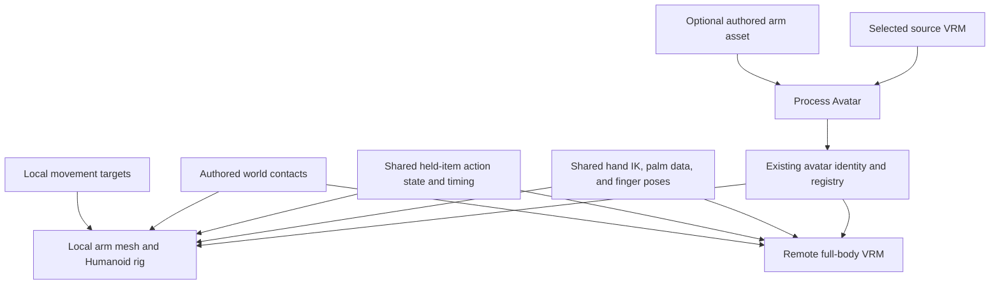

# Local First-Person Hands Specification

## 1. Objective

Give the local player first-person hands and arms derived from their selected VRM avatar. Reuse the remote avatar's hand IK, palm/contact conventions, finger-pose assets, and held-item action system. Allow first-person shoulder placement, holding positions, and motion trajectories to be tuned for the camera independently of third-person poses.

The local player normally sees hands and forearms. Other clients continue to see the player's complete selected VRM. Avatar selection and gameplay identity remain shared between these representations.

The project uses Unity 6000.5.7f1, FishNet 4.7.3, URP, and the New Input System.

## 2. Scope and decisions

| Area | Requirement |
| --- | --- |
| Appearance | Preserve the selected VRM's arm/hand appearance, materials, and relevant attached details. |
| Clothing | There is no clothing system, wardrobe, garment swapping, or separate clothing-processing workflow. Anything already belonging to the VRM is simply part of that avatar. |
| Local geometry | Generate arms-only geometry while retaining a valid Humanoid skeleton. A visible or hidden full-body mesh is unnecessary. |
| Asset workflow | Extend Unity avatar processing, with an optional authored companion asset when automatic extraction needs cleanup. |
| Shared behavior | Share hand solving, palm/grip conventions, finger poses, item/action state, and action timing. Exact local and remote world-space poses need not match. |
| Holding settings | Global first-person spatial defaults with optional per-item overrides, using the existing held-item configuration system. |
| Held items | Retain one-handed item holding and throwing. Render items at their actual world size. |
| Empty hands | Low resting IK targets, movement bounce, falling flail, and landing response. |
| Fingers | Reusable relaxed, grip, and open poses shared by local and remote hands. No individual fingertip contact solver. |
| World contacts | Reusable authored hand contacts, with both hands on the cart steering wheel as the first integration. |
| Rendering | Use the world camera and its projection, normal depth occlusion, and modest obstruction-driven retraction for held poses. |
| Release | Release immediately from the visible local item's resolved world pose, retaining existing aim, strength, and velocity inheritance. |
| Recovery | Fixed shared follow, pause, and return deadlines, independent of arm reach or obstruction. |
| Networking | Use existing item-motion, action, avatar, and seating state. No new messages, replicated fields, or bone/target streams are required for this scope. |

Two-handed items, passenger handholds, carrying/carried hand contacts, full local body rendering, local spring simulation, and full finger contact IK are outside this implementation. Remote avatars retain their normal full-body movement animation; the new free-hand movement gestures are first-person presentation.

## 3. Representation and shared boundaries

Extract hand solving from the full-body IK implementation into a shared class. The local rig must not require foot calibration, foot IK, head-look processing, the complete locomotion graph, or the remote VRM/spring runtime merely to move its hands.

Retain a valid Humanoid Animator and mapped skeleton. Removing body geometry does not mean deleting hips, spine, head, or leg bones required by the rig. Each generated or imported companion must use a Humanoid Avatar compatible with its own hierarchy.

Use a minimal local PlayableGraph with a stable base pose, shared finger-pose layers, and the shared hand IK pass. Reuse the established held-item action implementation with different placement inputs; do not introduce a second owner throw state machine.

## 4. Avatar asset preparation

### 4.1 Unity processing

Extend **Two Birds > Process Avatar** to prepare both remote and first-person outputs from one avatar identity.

1. Resolve the original VRM and its existing avatar settings/ID.
2. Preserve authored settings and any first-person source override.
3. Generate arm geometry from the source, or use the authored companion when assigned.
4. Produce a first-person prefab with the necessary mesh renderers, complete Humanoid hierarchy, Animator, and local presentation binding.
5. Generate/cache the left and right palm calibration data needed by the shared hand solver.
6. Store the first-person output alongside the existing registry/settings data for the same avatar.
7. Keep processing repeatable: rebuild generated outputs without replacing the stable avatar ID or losing authored overrides.

Generate meshes in the editor, never by cutting the VRM each time a player spawns. Retain the upper-arm geometry necessary for bending and reaching, while framing the camera so hands and forearms normally dominate the view.

Use Humanoid arm/hand mappings and associated deformation bones to identify relevant geometry. Preserve skin weights, bind poses, UVs, normals, materials, and relevant arm/hand attachments. Compact unused vertices after removing unwanted triangles so the output does not retain the entire body vertex buffer.

Do not assume arms correspond to a separate renderer or material. A single skinned mesh may contain the whole avatar. Likewise, do not create a separate garment pipeline: process the relevant parts of the supplied avatar as one appearance source.

Bone weights identify deformation influence, not an artist's ideal cut boundary. Automatic extraction must not be treated as a guarantee of clean shoulders or intact arm details. Use the authored override when the generated cut removes desirable geometry or exposes an unacceptable boundary.

The first-person prefab must not contain active duplicate gameplay physics, spring simulation, or a hidden full-body renderer. Preserve any bones needed to deform the retained geometry even when their source secondary-motion systems are omitted.

### 4.2 When Blender is needed

**Blender is optional for normal avatar onboarding.** It becomes the manual cleanup route when Unity's automatic extraction does not produce acceptable arm geometry. It is not required for finger posing.

For an authored override:

1. Keep the original full-body VRM unchanged. Work on a copy and retain the editable Blender file.
2. Import the copy with a VRM-compatible Blender workflow. The [VRM Add-on for Blender](https://github.com/saturday06/VRM-Addon-for-Blender) provides VRM import, editing, and export.
3. Remove head, torso, and leg geometry while preserving both complete arms/hands and their desired appearance.
4. Keep the original armature, Humanoid mappings, rest pose, skin weights, UVs, and material assignments. Do not collapse the armature to an arms-only skeleton.
5. Clean the shoulder/upper-arm boundaries. Cap a cut where it can become visible during reaching, flailing, or camera extremes.
6. Export a companion rigged asset, preferably a companion VRM to fit the existing import workflow. Preserve source scale and orientation, and use the imported companion's matching rig/mesh binding.
7. Assign the companion to the original avatar's first-person override field and process the original avatar again.
8. Use the generated first-person prefab in play. Do not register the companion as another selectable avatar or manually modify a generated prefab to preserve an override.

The user must visually judge the resulting cut, deformation, and appearance in Unity. A Blender round trip can require material or import adjustment; preserving the original source makes that work isolated to the first-person companion.

## 5. Settings and pose data

Extend existing settings where their responsibilities overlap. Reuse the existing avatar ID, registry, avatar settings, item definitions, and held-item defaults rather than adding parallel identity or item configuration systems.

| Data | Ownership and behavior |
| --- | --- |
| First-person hold/charge positions and rotations | Shared defaults in the held-item settings system; optional first-person spatial override on an item definition. |
| Third-person hold/charge positions and rotations | Retain independently authored third-person values. |
| Charge-pose, follow, pause, and return durations | One shared timing configuration, including existing per-item timing overrides where applicable. First-person spatial overrides do not copy or override these durations. |
| Grip position and rotation | One shared item-to-palm definition for local and remote presentation. |
| Procedural resting, airborne/fall, and landing targets | Shared first-person settings for both hands, including target rotations, blending, and motion strength. |
| Avatar placement/reach corrections | Optional fields on the avatar's existing settings; preserve limb proportions. |
| Finger poses | Reusable Humanoid pose clips with relaxed, grip, and open defaults; item/contact references choose the appropriate pose. |
| World contacts | Authored target transforms and hand/pose metadata associated with the relevant object. |
| Generated arm/palm data | Editor-generated avatar data, cached by a bound representation. |

The effective first-person item pose uses its explicit first-person override when enabled, otherwise the global first-person defaults. Keep the shared grip offsets and common timing selection independent of that spatial choice.

Use size-aware placement based on the avatar's generated dimensions and the selected presentation frame. Do not require hand positions to be authored independently for every avatar and item combination. Allow per-avatar offsets for unusual proportions without changing the avatar's limb lengths to force contact.

## 6. Shared hand IK and finger posing

### 6.1 Palm and arm solving

Use the same hand solver for local arms, remote avatars, held-item contacts, and custom authored contacts.

Both hands need a consistent palm convention, wrist-to-palm position/rotation conversion, Unity IK-goal calibration, reach handling, and deliberate elbow hints. Extend the generated left-hand data to match the right-hand palm convention rather than preserving an asymmetric wrist-only contact definition.

Cache the Animator, bone references, calibration, and arm lengths on binding. Preserve a stable base pose for target blending and unreachable poses.

For held items, the palm pose and shared grip offset determine the item pose. Any correction to the visible item/hand pair must preserve this relationship. For world contacts, the authored world-space palm target determines the hand pose through the same calibration.

Do not stretch limbs to reach a target. Use size-aware placement and optional avatar offsets; if a world contact remains unreachable, blend that hand away from the contact. The associated gameplay interaction, including driving, remains available.

### 6.2 Finger poses

Provide three reusable starting poses:

- **Relaxed:** resting and ordinary free-hand motion.
- **Grip:** holding an item or an authored contact.
- **Open:** release and expressive falling motion.

Represent these as static Humanoid muscle clips, shared by local and remote representations. Blend them through independent left/right finger-only PlayableGraph layers, excluding arms, wrists, body/root motion, and IK channels. Unity provides [left/right finger mask sections](https://docs.unity3d.com/6000.0/Documentation/ScriptReference/AvatarMaskBodyPart.html), and [Humanoid retargeting](https://docs.unity3d.com/6000.0/Documentation/Manual/Retargeting.html) supports reuse across compatible avatars.

An item or contact may select a custom reusable clip when a default grip is visually unsuitable. Do not require unique pose assets for every item or avatar. These poses approximate finger placement; they do not automatically discover surfaces or make every fingertip touch an arbitrary object.

Use existing action progression to blend gripping and opening on release. Finger poses must not change grip attachment, release physics, or action duration. Each hand's finger selection follows its active hand behavior.

Author poses in Unity using the installed UniHumanoid tools on a working avatar copy: use **MuscleInspector** to adjust fingers and **HumanPoseTransfer > Pose to AnimationClip** to export the pose. Isolate the fingers with runtime masks even if the export includes body curves. Temporary authoring components belong on the working copy, not the gameplay scene. No new one-off authoring tool is required.

## 7. Procedural first-person movement

Animate free hands by moving and rotating IK targets, blending between authored state targets, and applying small procedural offsets. A separate library of full-body movement clips is unnecessary for this local presentation.

| Situation | Hand behavior |
| --- | --- |
| Grounded and still | Reachable low resting targets, mostly below the frame. |
| Grounded movement | Subtle bounce driven by effective movement speed; walking and running vary continuously. |
| Rising during an ordinary jump | Subtle airborne pose without pronounced flailing. |
| Short downward jump fall | A weak version of the falling flail; ordinary jump descent must not have zero falling expression. |
| Sustained or fast descent | Smoothly increase flail amplitude and open-hand expression with descent duration and/or downward speed. |
| Landing | Brief target dip and recovery, scaled by landing severity. |
| Holding, charging, or recovering | The occupied hand follows the item/action pose instead of free-hand gestures. |
| Authored world contact | The occupied hand remains on its contact instead of receiving free-hand bounce or flail. |

Use the same fall motion family at weak and strong intensity so an ordinary jump can transition naturally into a longer fall. Avoid a binary threshold that leaves short downward falls motionless. Reset fall/landing accumulation when leaving the relevant movement context.

Seated and carried contexts must not accidentally trigger falling gestures from stale or suspended motor data. Driver hands use wheel contacts. Other attached contexts retain applicable held or relaxed hand behavior; special passenger/carry contacts are not part of this phase.

Read effective motor state and velocity; do not consume gameplay input again to determine presentation. Existing motor simulation and context events can update cached state. Continuous bounce and interpolation advance during the normal animation evaluation, while state changes and target ownership remain event driven where practical.

Resolve each hand's active behavior explicitly. Item actions/holding and active interaction contacts take priority over free-hand gestures. The cart's existing driver restriction prevents equipped-item conflicts. Retain explicit target ownership so clearing one behavior does not erase another behavior's target.

## 8. Local lifecycle and evaluation

Create the local arm representation from the existing resolved avatar identity. Do not enable the full remote avatar instance for the owner just to obtain hands.

On avatar selection changes:

1. Prepare the replacement local rig and cache its bindings/calibration.
2. Preserve the gameplay player, inventory selection, action state/age, and active interaction context.
3. Rebind the current item's palm attachment, finger pose, and any world contacts.
4. Switch the visible representation only after the replacement is ready.
5. Release the previous rig and its subscriptions/resources.

Changing avatar while holding, charging, recovering, or driving must not reset gameplay, replay the action, duplicate the item, or leave stale targets on the old skeleton. Ownership changes and teardown must remove local presentation cleanly.

Use an explicit evaluation sequence:

1. Observe gameplay/context changes and prepare the camera and world presentation transforms.
2. Select the local placement frame and active per-hand targets.
3. Resolve held-pose obstruction and reach while preserving the grip relationship.
4. Evaluate the base pose, shared finger layers, and hand IK.
5. Commit coherent palm/item presentation and the pose available for release.

Ensure the steering wheel and camera have updated before their dependent targets evaluate. Avoid separate unordered LateUpdate writers that move fingers, hands, or the held item after their shared pose has been resolved.

Use the existing presentation ordering where appropriate, without making the local rig join the full VRM/spring runtime. Cache references on binding/start; do not repeatedly find cameras/bones, reinstall unchanged targets, or advance the same action twice per frame.

## 9. Camera, world contacts, and obstruction

Render arms and local held items with the existing world camera, its FOV, and normal depth testing. Do not introduce an always-on-top viewmodel, separate first-person FOV, or overlay camera for this scope.

Ordinary holding and free-hand targets use a camera-relative presentation frame. Tune reachable targets and shoulder placement to keep mesh cuts and near-plane intersections outside normal views.

When hands attach to the steering wheel, use a seat/body-relative shoulder frame. The world targets remain fixed to the visual wheel as the camera turns. Hands may naturally leave the frame when looking away; they must not rotate around the camera or drag across the wheel to remain visible. Blend transitions between the ordinary and contact frames.

Nearby geometry occludes arms/items normally. Apply modest obstruction-driven retraction to the held pose before committing its hand/item placement. Retraction must preserve the grip and use the item's world-size clearance envelope. World-contact hands remain at their actual targets instead of receiving this camera-relative pullback.

Reuse the existing release-clearance constraints. If there is no valid accessible release pose, retain the existing charge-cancellation behavior and keep the item held rather than launch through geometry. Obstruction resolution must feed both presentation and release, avoiding an independent launch-only teleport.

This is cosmetic arm positioning, not physical arm collision or full-body collision avoidance.

## 10. Held items, release, and recovery

### 10.1 Shared attachment

Replace the owner's separate half-scale camera-slot attachment with the shared palm/grip presentation path. Preserve an item's normal world scale through any avatar-parent scaling. Do not introduce a duplicate networked or physics item for first-person rendering.

Local and remote hand paths may differ, but both use the same item identity, item-to-palm grip data, and action progression. Items must not change size when equipped, released, or observed by another client.

Only the current item hand is reserved for holding and throwing. A support-hand grip and two-handed release coordination are deferred. The other hand remains available for appropriate free-hand behavior.

### 10.2 Immediate local release

When use ends, release immediately from the visible local item's coherent resolved world pose, including current obstruction/clearance adjustment. Do not substitute a separate body-derived origin or wait for a forward-swing animation.

Preserve the existing camera-derived aim, charge-to-strength calculation, inherited player velocity, angular velocity, local prediction, and item simulation ownership. First-person pose tuning changes appearance and the selected release origin, not throw strength or the input response delay.

Rendering and release must consume the same resolved presentation data. Avoid stale prior-avatar bindings, a previous uncorrected hand target, or independent calculations that let the item visibly separate from the palm at release.

### 10.3 Remote visual handoff

Remote physics begins immediately from the submitted local release motion. The remote third-person held pose can differ from that origin, so provide a brief, bounded render-only transition from the displayed held item to the actual presented projectile trajectory.

The remote hand and item must use a consistent visual handoff so they do not visibly separate at the transition. Use the current displayed item pose, the received release motion/action identity, and the existing presentation timing. Do not delay physics, alter the reported trajectory, or transmit another pose to drive this effect.

The correction must converge quickly and cease when its item/release is no longer applicable, such as pickup or removal. It must not keep drawing an obsolete release or sustain a large visual displacement after a collision. Different local and remote held poses prevent perfect spatial agreement at the release instant; the required result is a smooth short handoff followed by the same projectile trajectory, without a conspicuous snap or prolonged false path.

### 10.4 Fixed common recovery

Use fixed phase deadlines measured from the shared recovery/action start:

| Phase | Deadline |
| --- | --- |
| Follow | Follow duration |
| Pause | Follow duration + pause duration |
| Return complete | Follow duration + pause duration + return duration |

With the existing default durations, recovery is 0.20 seconds follow + 0 seconds pause + 0.20 seconds return, totaling approximately 0.40 seconds. Item overrides may provide different shared durations.

Reaching the hand's limit, losing a follow target, or encountering an obstruction stops spatial following and retains an appropriate reachable pose until the phase deadline. It must not advance the normal gameplay recovery clock or permit early reuse. Preserve lifecycle cancellation/rejection handling separately from normal completion.

The owner completes the existing recovery action at the common deadline; observers derive visual phase timing from the same action age. Avatar proportions, local mesh availability, and first-person placement must not change the time at which the next item becomes visible/usable under existing equipment rules. This intentionally removes reach-dependent early recovery.

## 11. Authored world contacts and the steering wheel

Provide reusable contact authoring that supplies the requested hand, a world-space palm pose, appropriate finger-pose selection, and reach/blend information to the shared hand system. Existing gameplay context selects when contacts are active; do not build automatic reaching toward every interactable or extend hands to the pickup ray's full range.

For the cart:

1. Add left and right grip-target children under the visual steering wheel in the cart prefab.
2. Author palm position/orientation and the grip finger pose at each target.
3. Resolve the targets from the driver's existing cart reference and driver seat index.
4. Follow the visual wheel's steering rotation and cart smoothing on both local and remote clients.
5. Clear/blend out the contact binding on seat exit, context replacement, or teardown.

Keep the existing driver equipment restriction. Passenger equipment behavior remains intact. Each hand can independently blend away from an unreachable target while driving continues.

The generic contact boundary must be reusable by other authored interactions later, but passenger grips, carrying contacts, and two-handed item behavior are not required content for this implementation.

## 12. Networking contract

No new RPCs, network-message types, replicated fields, or recurring message streams are required for the defined feature.

| Presentation need | Existing source |
| --- | --- |
| Avatar and local arm selection | Selected avatar ID and avatar registry. |
| Held object and grip/finger selection | Existing inventory/item identity plus shared item content. |
| Charging, release, and recovery | Existing item action state, sequence, and action age. |
| Actual release origin and trajectory | Existing ItemMotion position, rotation, velocity, and angular velocity payload. |
| Steering-wheel contact activation | Existing seated cart identity and seat index. |
| Steering-wheel target movement | Existing cart steering state and visual wheel transform. |
| Remote render-only release correction | Already displayed held pose plus the received item motion/action. |
| Local bounce and flail | Local motor and context state; no additional replication. |

Do not network hand/finger transforms, IK goals, elbow hints, camera-relative rig transforms, gesture strength, or visual correction offsets. Shared content and existing semantic state determine those locally.

The generic contact API does not itself replicate arbitrary contact selections. Any later interaction must activate matching contacts through its gameplay state. If implementation reveals that this defined scope needs additional messages or fields, explicitly identify the payload, trigger, and reason before introducing them; that would change this contract.

## 13. Integration responsibilities

| Existing area | Required responsibility |
| --- | --- |
| AvatarProcessor | Repeated arm-mesh/prefab generation, authored override preservation, and symmetric palm data. |
| AvatarRegistry / AvatarSettings | First-person output reference and optional avatar placement corrections under the existing identity. |
| AvatarHumanoidIK | Extract reusable hand logic while retaining remote foot/head behavior in the full-body path. |
| AvatarAnimationGraph and local graph | Shared finger-layer implementation; minimal local base pose and ordered hand IK. |
| PlayerAvatarPresentation / AvatarPresentation | Reuse identity, lifecycle, and binding semantics for the dedicated local representation. |
| HeldItemSettings / ItemDefinition / HeldItemPose | Separate local spatial tuning from common grip and timing data; global defaults and explicit item overrides. |
| PlayerHeldItemPresentation | Shared action progression, representation-specific pose inputs, coherent release data, and fixed recovery deadlines. |
| PlayerEquipment / WorldItem | Replace the half-scale owner attachment and implement coherent local/remote visual item handoffs. |
| PlayerInventory / WorldItemRegistry | Preserve immediate prediction and existing release payload/simulation flow. |
| PlayerPresentation / PlayerMotor | Provide the camera frame and cached movement observations for local targets. |
| PlayerSeating / GolfCartPresentation / cart prefab | Resolve driver contacts from existing context and attach them to the animated visual wheel. |

Keep new shared logic at the actual local/remote boundaries. Do not add a general animation framework, parallel avatar registry, extra physics player, or a second gameplay action state machine.

## 14. Implementation and authoring sequence

1. Separate shared hand calibration/solving from full-body IK, then establish shared per-hand finger layers.
2. Extend avatar settings/processing and generate first-person outputs for the supported avatars.
3. Add the local representation and avatar-swap binding lifecycle.
4. Add first-person spatial defaults/overrides and connect world-sized held items to the shared grip path.
5. Add resolved obstruction/release placement, fixed common recovery, and the remote visual handoff.
6. Add shared procedural target settings and free-hand movement states, including weak short-fall flailing.
7. Author the default finger clips and the cart's two wheel contacts.
8. Complete the user's visual acceptance pass and apply necessary pose or asset corrections.

Required Unity content work includes generated arm meshes/prefabs, first-person settings, reusable finger-pose clips, a local presentation component, and the two authored cart contact transforms. Expose these authoring requirements before implementation creates them. Runtime construction can follow the existing camera/presentation lifecycle; editing the gameplay scene is not required by this design.

Use Unity CLI where available and Unity MCP as fallback for Unity operations. Let Unity generate .meta files. Extend the repeatable avatar processor rather than creating one-off migration tools; apply required atomic data changes directly. Do not run automated validation or Play Mode on the user's behalf unless explicitly requested.

## 15. User visual acceptance

The user must assess the following in Unity after implementation:

- **Avatar appearance:** Each selected avatar supplies its own hands/forearms and relevant appearance details. No head, torso, or leg geometry enters normal first-person play. Mesh cuts remain acceptable during bending, flailing, and camera extremes.
- **Processing:** New avatars obtain first-person outputs through Process Avatar. Reprocessing preserves IDs, tuning, and authored overrides. A cleaned companion affects only first-person appearance.
- **Local/remote identity:** The owner sees arms while observers see the complete selected avatar. Changing avatar while holding, charging, recovering, or driving keeps the item/action/contact state coherent.
- **Grip alignment:** Rock, basketball, mushroom, and wheel contacts align to the palms on both supported avatars. Fingers use appropriate approximate poses; items do not drift or change size during equip/release.
- **Tuning inheritance:** A global first-person holding change affects items using defaults. An explicit item override affects that item's first-person placement without changing the shared grip, third-person placement, or action timing.
- **Free-hand movement:** Resting hands remain mostly low. Walking/running adds restrained bounce. Ordinary jump descent visibly includes weak flailing; sustained/fast descent increases it smoothly. Landing response matches impact severity.
- **Behavior priority:** Holding/charging/recovery and wheel contacts retain control of occupied hands while the free hand can animate. Seated/carried contexts do not produce accidental falling gestures.
- **Reach:** Unusual avatar proportions use sensible placement without stretched bones. Unreachable wheel contacts disengage smoothly without disabling driving.
- **Camera and walls:** Hands leave view naturally when looking away from the wheel. Arms/items obey world occlusion, held poses retract near obstructions, and normal views avoid near-plane clipping or exposed arm cuts.
- **Local release:** Tap and charged throws respond immediately from the displayed item. There is no launch-only position jump, scale jump, or grip separation. Blocked release retains the held item under the existing cancellation behavior.
- **Remote release:** Observe another player throwing at different aim angles, while moving, and near obstacles. The item leaves the remote hand through a short coherent transition and promptly follows the reported projectile; no lingering offset, conspicuous snap, or obsolete release visual remains.
- **Recovery:** Short/long arms, retraction, and avatar swapping do not shorten the common recovery interval. Repeated throws expose consistent next-item appearance and reuse timing.

The implementation must also preserve the networking contract: all of the above behavior uses the existing payloads and state, without streaming presentation transforms or adding feature-specific network messages.
